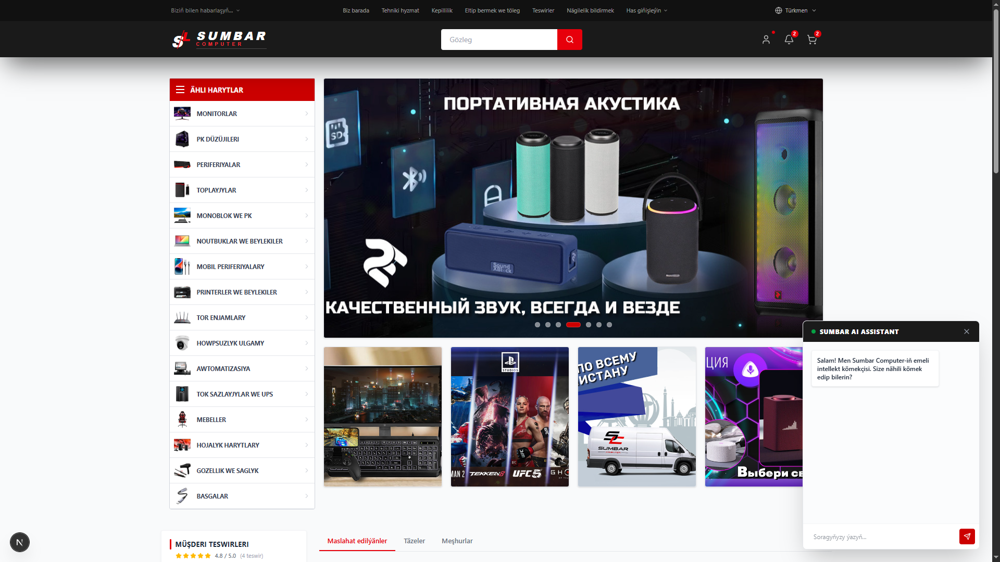
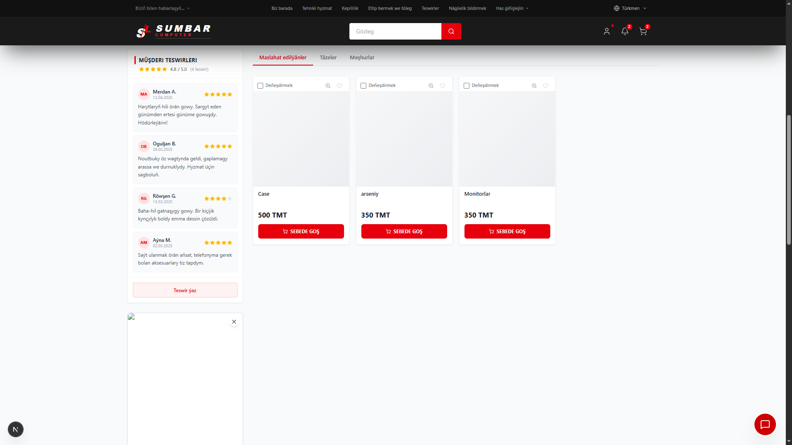
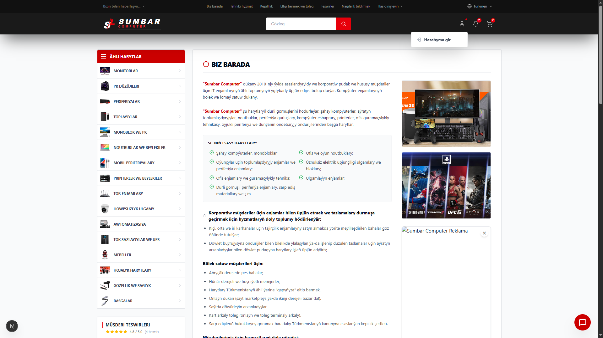
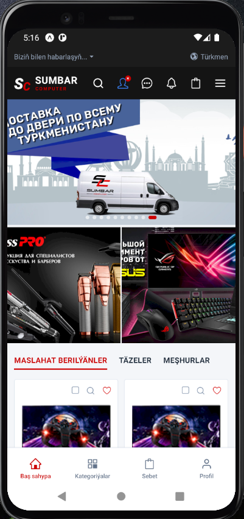
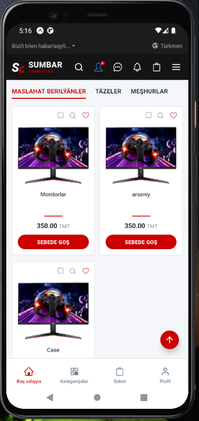
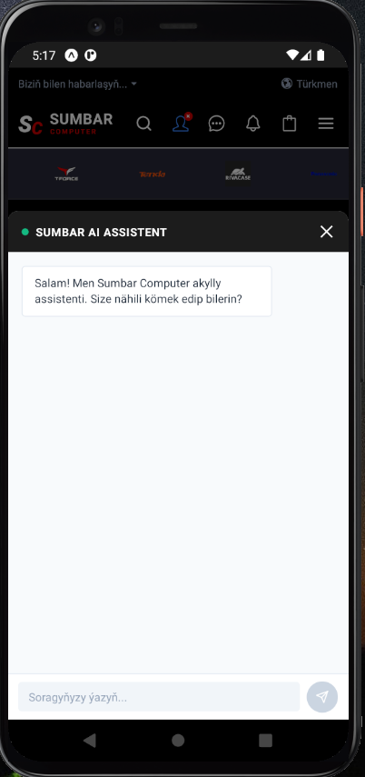

# 🚀 Full-Stack AI-Powered E-Commerce Ecosystem (Beta)

An advanced, modern, and highly scalable full-stack e-commerce solution featuring a customer storefront, a comprehensive admin dashboard, and a cross-platform mobile application, all powered by a robust serverless backend and AI integration.

---

## 📸 Project Previews & Screenshots

### 🌐 Web Storefront & Customer Experience

| Home & Catalog | Product Details | Search & AI Assistant |
| :---: | :---: | :---: |
|  |  |  |

### 🔐 Admin Dashboard & Control Panel

| Dashboard Overview | Product Management | Order Tracking |
| :---: | :---: | :---: |
|  |  |  |

### 📱 Cross-Platform Mobile Application

| Main Screen | Category & Filters | Shopping Cart & Profile |
| :---: | :---: | :---: |
|  |  |  |

*Note: Replace `YOUR_X_IMAGE_URL` with actual links to your screenshots uploaded to GitHub or an image hosting service.*

---

## 🛠️ Tech Stack & Architecture

The architecture is split into three distinct subsystems sharing a unified, real-time cloud database layer.

*   **Backend-as-a-Service (BaaS):** [Supabase](https://supabase.com) (PostgreSQL, Realtime Database, Authentication, and Secure Cloud Storage).
*   **Web Storefront & Admin Dashboard:** [Next.js](https://nextjs.org) (App Router), React, and [Tailwind CSS](https://tailwindcss.com) for high-performance, SEO-friendly, and responsive user interfaces.
*   **Mobile Application:** [React Native](https://reactnative.dev) providing a native look and feel across iOS and Android from a single codebase.
*   **State Management:** [Zustand](https://github.com) used for ultra-fast, lightweight, and predictable global state management across applications.
*   **AI Integration:** Integrated with [Google Gemini AI](https://deepmind.google) via secure API keys to deliver smart, automated shopping assistance.

---

## ✨ Key Features (Current Beta Status)

### 🌐 Web Storefront (Next.js + Tailwind)
*   **AI Shopping Assistant:** Built-in Gemini AI integration helping customers find products, answer queries, and get dynamic recommendations.
*   **Dynamic Product Catalog:** Real-time data fetching from Supabase with smooth filtering and category sorting.
*   **Seamless Cart System:** Highly optimized shopping cart workflows handled seamlessly by Zustand state management.

### 🔐 Admin Dashboard (Next.js)
*   **Content Management:** Full CRUD operations to add, edit, track, and delete products, categories, and inventory in real time.
*   **User & Order Insights:** Centralized control panel to view application metrics, customer logs, and active database changes.

### 📱 Cross-Platform Mobile App (React Native)
*   **Native Performance:** Clean, fluid UI components optimized for smooth scrolling and low-latency rendering on both mobile platforms.
*   **Cloud Synchronization:** Instantly reflects updates made via the Admin Dashboard through Supabase's realtime PostgreSQL engine.

---

## 🗺️ Production Roadmap (Future Enterprise Release)

*   [ ] Multi-Vendor Marketplace Support (SaaS structure).
*   [ ] Secure Payment Gateway Integration (Stripe, PayPal, and regional providers).
*   [ ] AI-Driven Automated Inventory and Trend Forecasting.
*   [ ] Real-time Driver Tracking and Live Order Shipping Updates.
*   [ ] Push Notification Engines for targeted user marketing.

---

## 📄 License & Contact
Developed by **Bahram Myradow** (Bahram2006). For professional inquiries or custom development requests, please contact me through **Kwork**.
